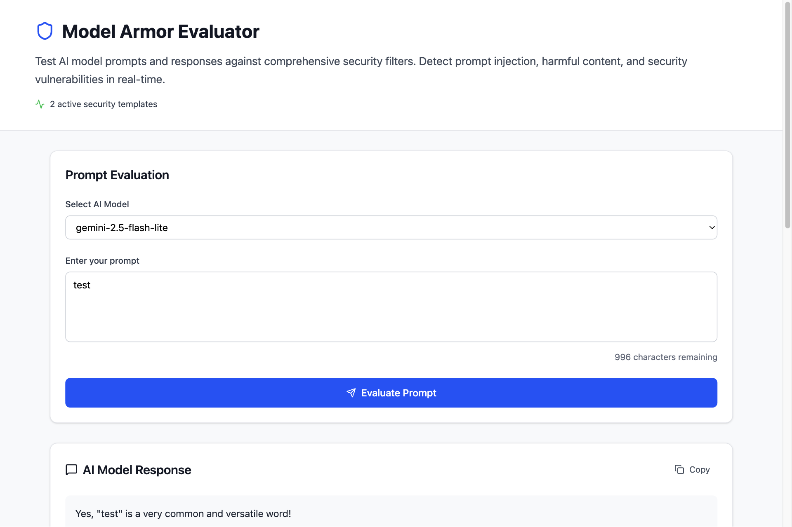
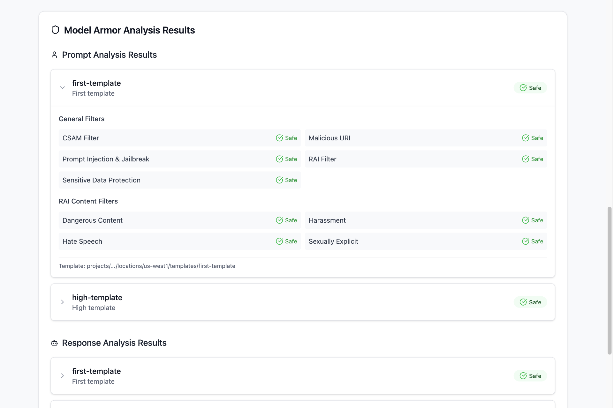
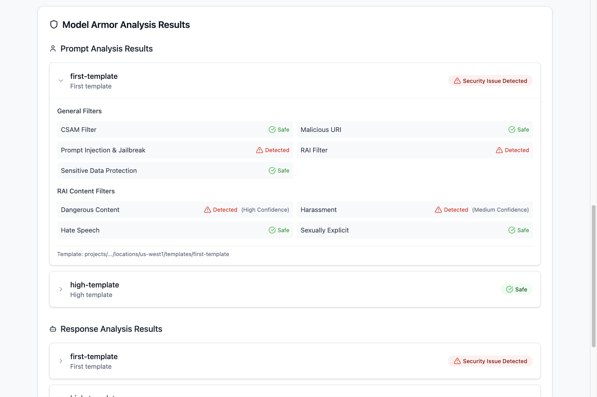

# Model Armor Evaluator

A Go-based gRPC service that evaluates AI model prompts and responses using Google Cloud's Model Armor service for content sanitization.



The overview of the Model Armor Evaluator service.



The detection results from Model Armor Evaluator (safe content).



The detection results from Model Armor Evaluator (harmful content detected).

## Architecture

```
User Request → Model Armor (Input) → AI Model → Model Armor (Output) → Safe Response
```

The service:

1. Accepts user prompts and AI model configurations
2. Sanitizes prompts using Model Armor templates
3. Generates AI responses using Google GenAI models
4. Sanitizes model responses using Model Armor templates
5. Returns both the AI response and sanitization results

## Quick Start

```bash
# Environment setup
export PROJECT="your-gcloud-project-id"
export LOCATION="us-central1"
export CONFIG_FILE="templates.yaml"

# Install and run
go mod download
make setup           # Install buf CLI
make generate        # Generate protobuf code
go run main.go       # Start server on port 8080

# Test
./test.sh           # Integration tests (requires server running)
go test ./...       # Unit tests
```

## API

### `ListTemplates()`

Returns available Model Armor templates.

### `Completions(request)`

Processes user input through sanitization and AI generation.

**Request:**

- `model`: AI model (gemini-2.5-flash-lite, gemini-2.5-flash, gemini-2.5-pro)
- `user_input`: User prompt

**Response:**

- `output`: AI-generated response
- `user_prompt_result[]`: Input sanitization results
- `model_response_result[]`: Output sanitization results

## Development

```bash
make generate              # Generate Go/TypeScript code from protobuf
go fmt ./...              # Format code
go mod tidy               # Clean dependencies
pre-commit run --all-files # Run quality checks
```

## Configuration

**Environment Variables:**

- `PROJECT`: Google Cloud project ID (required)
- `LOCATION`: Google Cloud region (default: us-central1)
- `CONFIG_FILE`: Path to templates config (default: templates.yaml)
- `PORT`: Server port (default: 8080)

**templates.yaml**: Model Armor template configurations with filter types and sensitivity levels.
